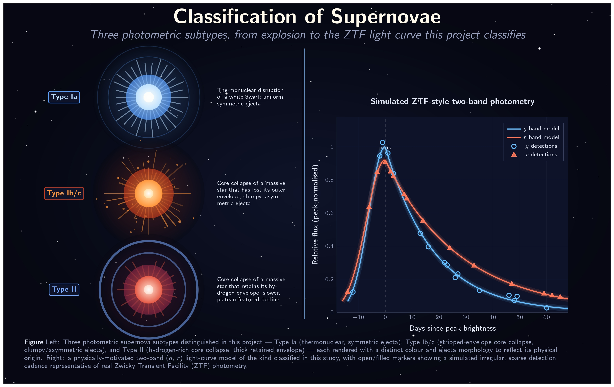
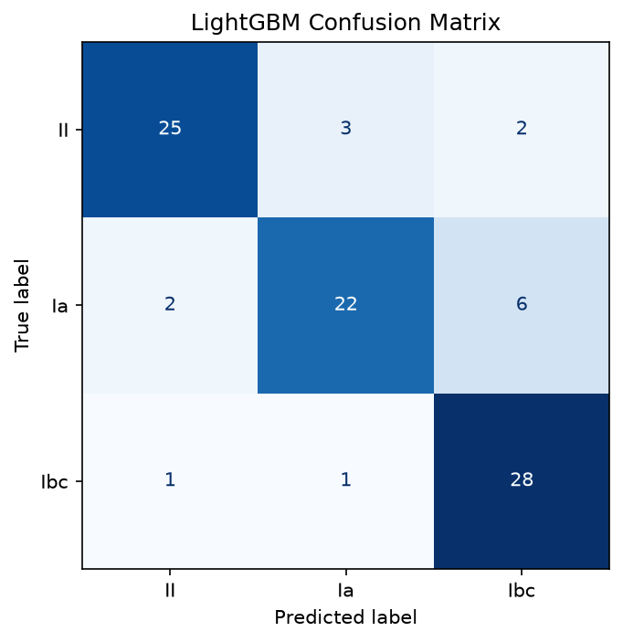
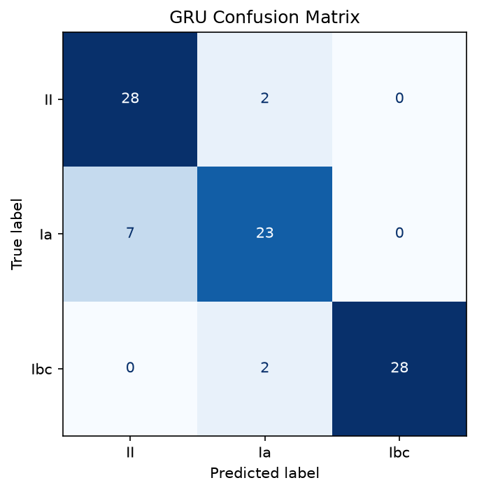
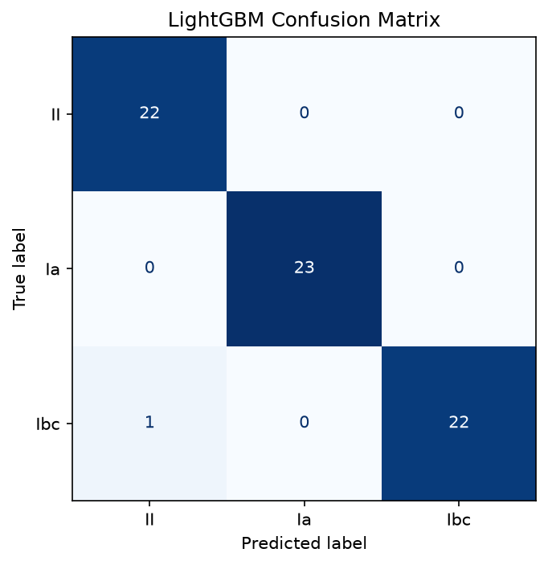
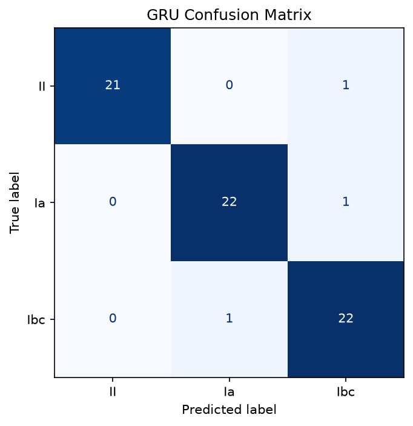
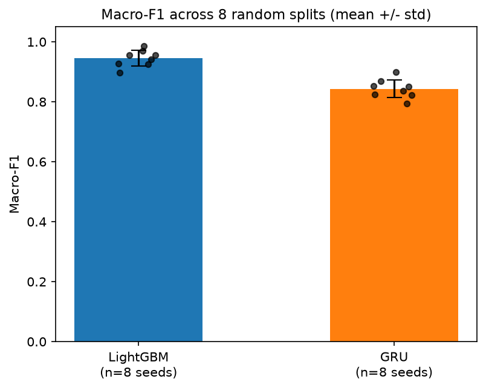
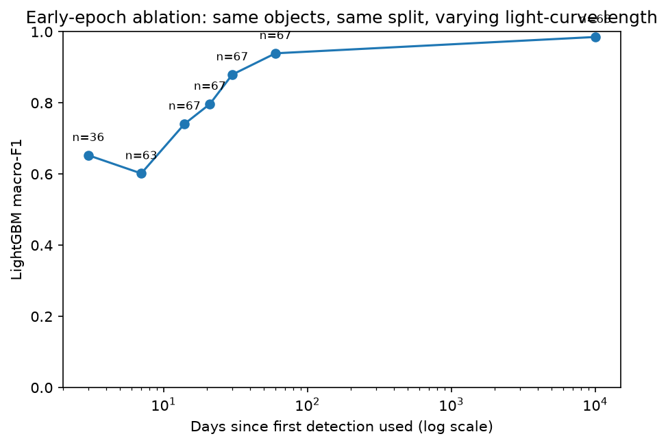
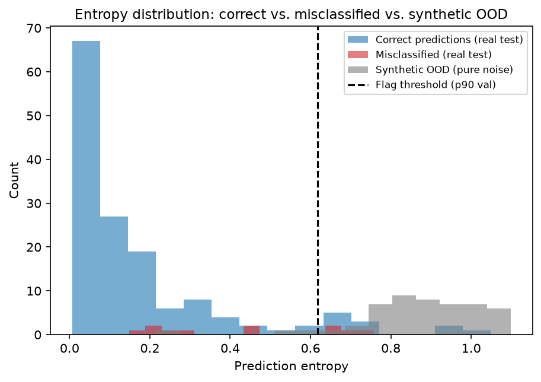

# sn-classification-ztf

### Photometric Classification of Supernova Subtypes from ZTF Light Curves — A LightGBM vs. GRU Comparison with LSST-Compatible Preprocessing

[](https://www.python.org/)
[](https://lightgbm.readthedocs.io/)
[-red.svg)](https://pytorch.org/)
[](https://alerce.online/)
[](#license)

---

## Overview

Wide-field time-domain surveys such as the **Zwicky Transient Facility (ZTF)** and the now-operational **Vera C. Rubin Observatory (LSST)** generate far more transient alerts than can ever be spectroscopically followed up. Fast, reliable **photometric-only** pre-classification of supernovae is therefore a genuine operational bottleneck for the alert-broker ecosystem (ALeRCE, Fink, Lasair).

This repository builds and rigorously evaluates a compact, reproducible **three-class supernova classifier** — **Type Ia**, **Type Ib/c**, and **Type II** — on real ZTF light curves, comparing:

- a **feature-engineered LightGBM** baseline (gradient-boosted decision trees on hand-crafted light-curve statistics), against
- a **GRU sequence model** (a recurrent network learning directly from resampled, multi-band flux sequences),

using a **synthetic dataset** for end-to-end pipeline validation and **four real, ALeRCE-sourced ZTF catalogues** (curated, naturally-imbalanced, expanded, and multi-seed) for the main study. The project also includes an early-epoch ablation (how classification quality degrades with light-curve length), class-weighting and cadence-interpolation ablations, and an entropy-based confidence/anomaly-flagging prototype.

The full write-up, methodology, and discussion are in [`Report/SNC_Report.pdf`](./Report/SNC_Report.pdf).

---

## The Visual

<p align="center">
  
</p>

<p align="center"><i>Left: the three photometric SN subtypes classified in this project — Type Ia (thermonuclear, symmetric ejecta), Type Ib/c (stripped-envelope core collapse, clumpy/asymmetric ejecta), and Type II (hydrogen-rich core collapse, thick retained envelope). Right: a physically-motivated two-band (g, r) light-curve model of the kind classified in this study, with open/filled markers showing a simulated irregular, sparse detection cadence representative of real ZTF photometry.</i></p>

---

## Features

- 🔭 **Real-data pipeline** — fetches spectroscopically-typed ZTF light curves directly from the public **ALeRCE** broker API (`fetch_real_data.py`), with a curated-balanced, naturally-imbalanced, and 3×-expanded catalogue variant.
- 🧪 **Synthetic data generator** — a seeded, parametric rise/decline light-curve simulator (`data/generate_synthetic_data.py`) used to sanity-check the full pipeline before touching real, noisier data.
- 🧮 **LightGBM baseline** — 8 physically-motivated features per band (amplitude, rise time, decline rate, skewness, kurtosis, cadence stats) plus cross-band colour/ratio features.
- 🔁 **GRU sequence model** — a 1-layer, 64-hidden-unit GRU over padded/masked, peak-normalised, multi-band flux sequences.
- 📊 **Rigorous evaluation** — macro-F1, per-class precision/recall, confusion matrices, one-vs-rest ROC-AUC, and 95% **Wilson confidence intervals** for small-sample bins.
- 🔬 **4 ablation studies** — early-epoch cutoff, class-weighting, cadence interpolation, and 8-seed multi-split robustness testing.
- 🚨 **Confidence / anomaly-flagging prototype** — Shannon-entropy-based screening signal, validated against real misclassifications and injected synthetic out-of-distribution objects.
- 🛰️ **LSST-schema-compatible preprocessing** — the (time, band, flux, flux-error, detected-flag) schema deliberately mirrors the LSST/ZTF alert-packet format for forward compatibility.
- ✅ **Tested & reproducible** — `pytest` unit tests, a fixed 70/15/15 object-level split, numbered driver scripts, and a pinned Conda environment.

---

## Repository Structure

```
sn-classification-ztf/
├── Pictures/                       # Static images used in this README
│   └── SNC_Visual.jpg
├── Report/                         # Full project report
│   └── SNC_Report.pdf
├── data/
│   ├── download_data.py            # Entry point / router for data acquisition routes
│   ├── generate_synthetic_data.py  # Seeded synthetic light-curve generator
│   ├── synthetic_objects.json      # 600 synthetic objects (200/class)
│   ├── ztf_real_objects.json       # Curated real ZTF catalogue (450, balanced)
│   └── ztf_real_objects_natural.json # Naturally-imbalanced real ZTF catalogue (450)
├── src/
│   ├── preprocessing.py            # Schema handling, filtering, padding, object-level splits
│   ├── features.py                 # Engineered feature-table construction (LightGBM)
│   ├── evaluate.py                 # Metrics, confusion matrices, ROC, accuracy-vs-length
│   ├── anomaly.py                  # Prediction entropy + low-confidence flagging
│   ├── logging_utils.py            # Run logging helpers
│   └── models/
│       ├── lightgbm_model.py       # LightGBM training/evaluation
│       └── gru_model.py            # GRU dataset, model, training, inference
├── scripts/                        # Numbered, one-command driver scripts (see table below)
├── tests/                          # pytest unit tests
├── figures/                        # Synthetic-run outputs (confusion matrices, ROC, etc.)
├── figures_real/                   # Curated real-data run outputs
├── figures_natural/                # Naturally-imbalanced real-data run outputs
├── figures_real_expanded_350/      # 3×-expanded real-data run outputs
├── train.py                        # Main training + evaluation entry point
├── ablation_early_epoch.py         # Early-epoch-cutoff ablation
├── ablation_class_weight.py        # Class-weighting ablation
├── ablation_interpolation.py       # Cadence-interpolation ablation
├── multiseed_eval.py               # 8-random-seed robustness evaluation
├── error_analysis.py               # Misclassified-object inspection
├── validate_anomaly_detection.py   # Confidence/anomaly-flagging validation
├── fetch_real_data.py              # ALeRCE real-data fetcher (curated/natural/expand modes)
├── environment.yaml                # Conda environment specification
└── pytest.ini / conftest.py        # Test configuration
```

---

## About the Dataset

Two categories of light-curve data are used, each stored as a sequence of `(time [MJD], band [g/r/i], flux, flux_error, detected_flag)` tuples per object — a schema deliberately compatible with the LSST alert format.

| Catalogue | Source | Link |
|---|---|---|
| Real ZTF light curves | [Zwicky Transient Facility](https://www.ztf.caltech.edu/) alert stream, queried via the **ALeRCE** broker's public API | [alerce.online](https://alerce.online/) · [ALeRCE client docs](https://alerce-science.readthedocs.io/) |
| Synthetic light curves | Custom seeded parametric generator (rise/decline templates + injected photometric noise), used only for pipeline validation | `data/generate_synthetic_data.py` (this repo) |

**Dataset statistics:**

| Catalogue | n | Class distribution | Purpose |
|---|---|---|---|
| Real — curated (main) | 450 | Ia: 150, Ib/c: 150, II: 150 (balanced) | Primary model comparison, ablations, error analysis |
| Real — natural | 450 | Ia: 250, II: 106, Ib/c: 94 (imbalance ratio 2.66) | Class-weighting under genuine ALeRCE prevalence |
| Real — expanded | 1,050 | Ia: 350, Ib/c: 350, II: 350 (balanced) | Larger-sample estimate; anomaly validation |
| Synthetic | 600 | Ia: 200, Ib/c: 200, II: 200 (balanced) | Pipeline sanity check prior to real-data runs |

Objects with fewer than 3 detections are dropped. All train/validation/test splits (70/15/15) are performed **by object**, not by individual alert, to avoid leakage.

---

## About the Setup

### 1. Clone the repository

```bash
git clone https://github.com/riku-1825/sn-classification-ztf.git
cd sn-classification-ztf
```

### 2. Create the Conda environment from `environment.yaml`

```bash
conda env create -f environment.yaml
conda activate sn-classification-ztf
```

This installs Python 3.11, NumPy/Pandas/SciPy/scikit-learn, PyTorch (CUDA 12.4 wheels — swap the `--extra-index-url` in `environment.yaml` for a CPU or different CUDA build if needed), LightGBM, the `alerce` client, and `pytest`.

To update an existing environment instead of creating a new one:

```bash
conda env update -f environment.yaml --prune
```

### 3. Verify the install

```bash
pytest tests/ -q
```

---

## How to Run

All driver scripts live in `scripts/` and are numbered in the order you'd typically run them. Each also has an equivalent root-level Python entry point that it wraps.

| File | Description |
|---|---|
| `scripts/00_setup_env.sh` | Creates or updates the `sn-classification-ztf` Conda environment from `environment.yaml`. |
| `scripts/01_run_tests.sh` | Runs the full `pytest` unit-test suite. |
| `scripts/02_generate_synthetic_data.sh` | Generates the synthetic dataset (`data/generate_synthetic_data.py`), default 200 objects/class. |
| `scripts/03_fetch_real_data.sh` | Fetches a curated, class-balanced real ZTF sample from ALeRCE (default 150 objects/class). |
| `scripts/04_train_synthetic.sh` | Trains and evaluates both LightGBM and the GRU on the synthetic dataset. |
| `scripts/05_train_real.sh` | Trains and evaluates both models on the curated real ZTF dataset. |
| `scripts/06_run_all_synthetic.sh` | End-to-end: tests → generate synthetic data → train/evaluate (synthetic pipeline validation in one command). |
| `scripts/07_run_all_real.sh` | End-to-end: fetch real ZTF data → train/evaluate on it, in one command. |
| `scripts/08_ablation_early_epoch.sh` | Runs the early-epoch-cutoff ablation (`ablation_early_epoch.py`) on a given dataset. |
| `scripts/09_ablation_class_weight.sh` | Runs the class-weighting ablation (`ablation_class_weight.py`). |
| `scripts/10_ablation_interpolation.sh` | Runs the cadence-interpolation ablation (`ablation_interpolation.py`). |
| `scripts/11_error_analysis.sh` | Runs misclassified-object error analysis (`error_analysis.py`), producing per-object prediction tables and figures. |
| `scripts/12_run_all_analysis.sh` | Runs all four analyses (early-epoch, class-weight, interpolation, error analysis) back-to-back on one dataset. |
| `scripts/13_multiseed_eval.sh` | Repeats the LightGBM-vs-GRU comparison across `N` random seeds (default 5) to quantify split-to-split variance. |
| `scripts/14_validate_anomaly.sh` | Validates the entropy-based confidence/anomaly-flagging prototype (`validate_anomaly_detection.py`). |
| `scripts/15_fetch_and_train_natural.sh` | Fetches the naturally-imbalanced ALeRCE sample, trains/evaluates on it, and runs the class-weighting ablation on it. |
| `scripts/16_expand_real_data.sh` | Expands the real ZTF catalogue to a larger per-class count (default 350) and retrains/evaluates on the expanded set. |
| `train.py` | Core training + evaluation entry point used by the scripts above; trains LightGBM and the GRU on identical splits and writes figures/metrics. |
| `fetch_real_data.py` | Standalone ALeRCE real-data fetcher; supports `--balance_mode curated/natural` and `--total_budget`/`--n_per_class`. |
| `data/generate_synthetic_data.py` | Standalone synthetic light-curve generator. |

**Example — full real-data run from scratch:**

```bash
bash scripts/00_setup_env.sh
conda activate sn-classification-ztf
bash scripts/01_run_tests.sh
bash scripts/07_run_all_real.sh          # fetch + train/evaluate on curated real ZTF data
bash scripts/12_run_all_analysis.sh data/ztf_real_objects.json figures_real real
bash scripts/13_multiseed_eval.sh data/ztf_real_objects.json figures_real real 8
bash scripts/14_validate_anomaly.sh data/ztf_real_objects.json figures_real real
```

---

## Results

### Synthetic data (pipeline validation)

| Metric | Majority baseline | LightGBM | GRU |
|---|---|---|---|
| Accuracy | 33.3% | 83.3% | 88.3% |
| Macro-F1 | 0.167 | 0.832 | **0.878** |

On synthetic data the **GRU outperforms LightGBM** by +0.046 macro-F1 — confirming the full pipeline works correctly before moving to real, noisier data.

<p align="center">
  
  
</p>

### Real data — curated catalogue, single split (n = 68 test)

| Metric | Majority baseline | LightGBM | GRU |
|---|---|---|---|
| Accuracy | 32.4% | **98.5%** | 95.6% |
| Macro-F1 | 0.163 | **0.985** | 0.956 |

The ranking **reverses** relative to synthetic data — LightGBM makes a single test-set error (1/68); the GRU makes three.

<p align="center">
  
  
</p>

### Robustness checks: multi-seed, natural imbalance, and 3× expanded scale

| Catalogue | n | Majority baseline (macro-F1) | LightGBM macro-F1 | GRU macro-F1 |
|---|---|---|---|---|
| Real — curated, 8-seed mean | 450 | 0.163 | **0.945 ± 0.026** | 0.843 ± 0.030 |
| Real — natural (imbalanced) | 450 | 0.239 | **0.930** | 0.856 |
| Real — expanded (3× scale) | 1,050 | 0.165 | **0.956** | 0.893 |

LightGBM beats the GRU in **all 8 random seeds** (per-seed delta +0.058 to +0.134), and remains the stronger model under genuine class imbalance and at 3× the sample size.

<p align="center">
  
</p>

### Early-epoch ablation (LightGBM macro-F1 vs. days observed, real curated data)

| Cutoff (days) | n (test) | LightGBM macro-F1 |
|---|---|---|
| 3 | 36 | 0.653 |
| 7 | 63 | 0.602 |
| 14 | 67 | 0.741 |
| 21 | 67 | 0.797 |
| 30 | 67 | 0.879 |
| 60 | 67 | 0.939 |
| Full light curve | 68 | **0.985** |

<p align="center">
  
</p>

Macro-F1 roughly **doubles** from the 3-day cutoff to the full light curve — light-curve length is the single dominant factor in classification quality.

### Class-weighting ablation

| Catalogue | Imbalance ratio | Unweighted | Balanced | Delta |
|---|---|---|---|---|
| Curated (real) | 1.00 | 0.985 | 0.985 | 0.000 |
| Natural (real) | 2.66 | 0.930 | 0.930 | 0.000 |

Class weighting had **no measurable effect**, even under genuine 2.66× real-world class imbalance. Cadence interpolation onto a uniform 1-day grid likewise produced an identical macro-F1 (0.985 raw vs. 0.985 interpolated) on the curated catalogue.

### Confidence / anomaly-flagging validation (expanded test set, n = 158)

| Check | Result |
|---|---|
| Entropy predicts misclassification (ROC-AUC) | **0.852** (11 errors) |
| Error rate among flagged vs. unflagged objects | 25.0% vs. 4.9% |
| Synthetic OOD objects flagged | **47/50 (94.0%)** |
| Normal test objects flagged (false-positive-like rate) | 10.1% |

<p align="center">
  
</p>

---

## Key Findings

- **LightGBM is the robust, statistically-confirmed winner on real ZTF data** — mean 8-seed delta +0.102 ± 0.027 macro-F1 over the GRU, positive in every single seed — reversing the ranking seen on synthetic data (where the GRU was ahead by +0.046).
- **Light-curve length is the single dominant driver of accuracy**: macro-F1 roughly doubles from 0.65 at a 3-day cutoff to 0.99 on the full light curve, with direct implications for any early-warning / real-time classification use case.
- **Class-weighting and cadence interpolation had no measurable effect**, even under genuine 2.66× class imbalance — a useful negative result that simplifies the recommended production pipeline.
- **Results are stable** across 8 random seeds, a naturally-imbalanced catalogue, and a 3×-larger sample (1,050 vs. 450 objects) — the curated single-split result was not an artefact of a favourable split.
- **Errors concentrate in the Ia ↔ Ib/c confusion** on real data, physically expected since both are compact, rapidly-declining transients, whereas the slower, plateau-featured Type II is more distinct.
- **The entropy-based confidence/anomaly-flagging prototype works as a screening signal** (ROC-AUC 0.85 for predicting misclassification; 94% of injected synthetic out-of-distribution objects flagged), though it has only been validated against synthetic noise as an OOD proxy, not real astrophysical anomalies.
- Overall, the study is read as a **rigorous proof-of-concept** for ZTF-based, LSST-schema-compatible photometric SN typing — not an operational or spectroscopically-validated classification system.

---

## References

1. Bellm, E. C., Kulkarni, S. R., Graham, M. J., et al. 2019, "The Zwicky Transient Facility: System Overview, Performance, and First Results," *PASP*, 131, 018002.
2. Carrasco-Davis, R., Reyes, E., Valenzuela, C., et al. 2021, "Alert Classification for the ALeRCE Broker System: The Real-time Stamp Classifier," *AJ*, 162, 231.
3. Cho, K., van Merriënboer, B., Gulcehre, C., et al. 2014, "Learning Phrase Representations using RNN Encoder–Decoder for Statistical Machine Translation," *Proceedings of EMNLP 2014*, 1724–1734.
4. Förster, F., Cabrera-Vives, G., Castillo-Navarrete, E., et al. 2021, "The Automatic Learning for the Rapid Classification of Events (ALeRCE) Alert Broker," *AJ*, 161, 242.
5. Hložek, R., Malz, A. I., Ponder, K. A., et al. 2023, "Results of the Photometric LSST Astronomical Time-series Classification Challenge (PLAsTiCC)," *ApJS*, 267, 25.
6. Ivezić, Ž., Kahn, S. M., Tyson, J. A., et al. 2019, "LSST: From Science Drivers to Reference Design and Anticipated Data Products," *ApJ*, 873, 111.
7. Ke, G., Meng, Q., Finley, T., et al. 2017, "LightGBM: A Highly Efficient Gradient Boosting Decision Tree," *NeurIPS*, 30, 3146–3154.
8. Kessler, R., Narayan, G., Avelino, A., et al. 2019, "Models and Simulations for the Photometric LSST Astronomical Time Series Classification Challenge (PLAsTiCC)," *PASP*, 131, 094501.
9. Möller, A., Peloton, J., Ishida, E. E. O., et al. 2021, "Fink, a New Generation of Broker for the LSST Community," *MNRAS*, 501, 3272–3288.
10. Sánchez-Sáez, P., Reyes, I., Valenzuela, C., et al. 2021, "Alert Classification for the ALeRCE Broker System: The Light Curve Classifier," *AJ*, 161, 141.
11. Smith, K. W., Williams, R. D., Young, D. R., et al. 2019, "Lasair: The Transient Alert Broker for LSST:UK," *RNAAS*, 3, 26.
12. The PLAsTiCC Team, Allam, T. Jr., Bahmanyar, A., et al. 2018, "The Photometric LSST Astronomical Time-series Classification Challenge (PLAsTiCC): Data Set," arXiv:1810.00001.

---

## Citations

If you use this repository, its code, or its results in your work, please cite:

```bibtex
@techreport{bagh2026snclassification,
  title        = {Photometric Classification of Supernova Subtypes from ZTF Light Curves:
                   A LightGBM--GRU Comparison with LSST-Compatible Preprocessing},
  author       = {Bagh, Bhoumik Chandra},
  institution  = {Indian Institute of Technology Tirupati},
  year         = {2026},
  note         = {Summer School of Astronomy \& Astrophysics 2026 Project Report,
                   submitted to Ravi Raja Pothineni, Indian Space School, Jaipur},
  howpublished = {\url{https://github.com/riku-1825/sn-classification-ztf}}
}
```

Please also cite the underlying data and tool providers this project builds on: **ZTF** [1], **ALeRCE** [2, 4, 10], **LightGBM** [7], and the **GRU** architecture [3] — see [References](#references) above.

---

## License

This project is licensed under the **MIT License** — see the [LICENSE](./LICENSE) file for details.

> Real light curves are sourced from the public **ALeRCE** broker, which itself processes the public **ZTF** alert stream; usage of that data is subject to ALeRCE's and ZTF's own data-access terms. The synthetic dataset, preprocessing pipeline, model code, and all analysis in this repository are original work released under MIT.
